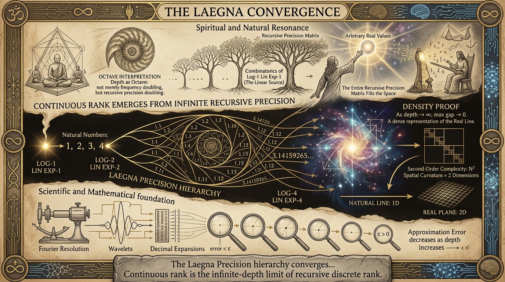
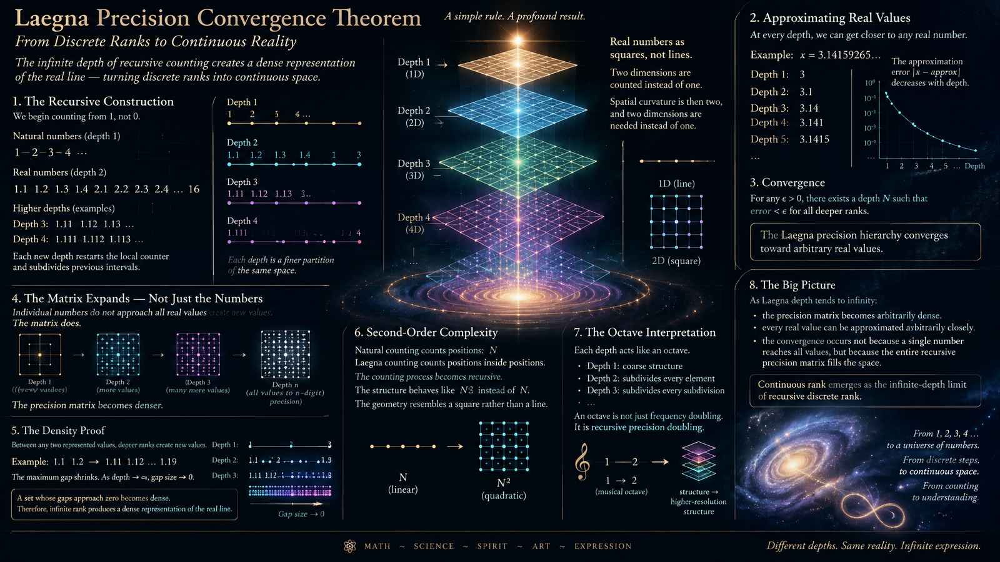
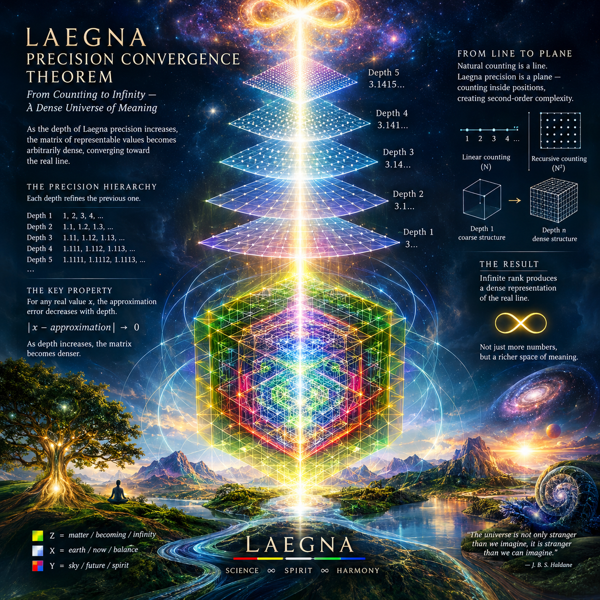

<br>

The following is somewhat draft, but also explaining why continuous systems give continuous ranks of log-4 lin exp-4 or log-2 lin exp-2; where discrete ranks for same levels are log-2 lin exp-2 is combinatorics of log-1 lin exp-1, the linear source.

Natural number:
- 1, 2, 3, 4

Real number
- 1.1, 1.2, 1.3, 1.4, 2.1, 2.2, 2.3, 2.4, etc to 16.

Real number rank is square:
- Two dimensions are counted instead of 1.

Spatial curvature is then two, and two dimensions are needed instead of one.

Counters become synchronous:
- As laegna numbers have octavian length for frequential depth (value);
- as counting goes on, real number counter can count to end of natural numbers on same frequency as side-process.

---

CoPilot:

# Laegna Precision Convergence Theorem

## Construction

Assume counting begins from:

```text
1
2
3
4
...
```

instead of:

```text
0
1
2
3
...
```

Now define rank depth.

Depth 1:

```text
1
2
3
4
...
```

Depth 2:

```text
1.1
1.2
1.3
...
2.1
2.2
2.3
...
```

Depth 3:

```text
1.11
1.12
1.13
...
```

Depth 4:

```text
1.111
1.112
1.113
...
```

and so on.

Each new depth restarts the local counter and subdivides previous intervals.

---

## Observation

At every depth:

```text
Depth n
```

creates a finer partition of the same space.

Example:

Depth 1:

```text
1
2
3
```

Depth 2:

```text
1.1
1.2
...
1.9
2.1
...
```

Depth 3:

```text
1.11
1.12
...
```

Thus:

```text
Depth n+1
```

always contains more detail than

```text
Depth n
```

while preserving the same structure.

---

## The Key Property

Suppose x is any real value.

Example:

```text
x = 3.14159265...
```

At every depth we can construct the closest available Laegna value.

Depth 1:

```text
3
```

Depth 2:

```text
3.1
```

Depth 3:

```text
3.14
```

Depth 4:

```text
3.141
```

Depth 5:

```text
3.1415
```

and so on.

The approximation error becomes:

```text
|x - approximation|
```

which decreases as depth increases.

---

## Convergence

For any positive tolerance:

```text
ε > 0
```

there exists a depth N such that:

```text
error < ε
```

for all deeper ranks.

This is the standard definition of convergence.

Therefore:

> The Laegna precision hierarchy converges toward arbitrary real values.

---

## What Actually Approaches Infinity

An important correction appears here.

Individual numbers do not approach all real values.

The matrix does.

At Depth 1:

```text
few values
```

At Depth 2:

```text
more values
```

At Depth 3:

```text
many more values
```

At Depth n:

```text
all values representable to n-digit precision
```

Thus the set itself expands.

The precision matrix becomes denser.

---

## The Density Proof

Between any two represented values:

```text
a
b
```

there exists a deeper rank creating new values.

Example:

```text
1.1
1.2
```

becomes:

```text
1.11
1.12
...
1.19
```

Therefore the maximum gap shrinks.

As depth approaches infinity:

```text
gap size → 0
```

A set whose gaps approach zero becomes dense.

Thus:

> Infinite rank produces a dense representation of the real line.

---

## Why This Becomes Second-Order Complexity

Natural counting:

```text
1
2
3
4
...
```

counts positions.

Laegna precision counting:

```text
1
1.1
1.11
1.111
...
```

counts positions inside positions.

Therefore complexity becomes recursive.

The counting process itself becomes an object being counted.

This is why the structure behaves approximately like:

```text
N²
```

instead of:

```text
N
```

and why the geometry resembles a square rather than a line.

---

## Octave Interpretation

Every depth acts like an octave.

```text
Depth 1
```

gives coarse structure.

```text
Depth 2
```

subdivides every element.

```text
Depth 3
```

subdivides every subdivision.

and so on.

Therefore:

```text
octave
```

is not merely frequency doubling.

It is recursive precision doubling.

The local musical octave:

```text
1 → 2
```

becomes the general rank operation:

```text
structure
→
higher-resolution structure
```

---

## Conclusion

The strongest provable version of the idea is:

> As Laegna depth tends to infinity, the precision matrix becomes arbitrarily dense.

> Every real value can be approximated arbitrarily closely by sufficiently deep Laegna representations.

> The convergence occurs not because a single number reaches all values, but because the entire recursive precision matrix fills the space.

> Therefore continuous rank emerges as the infinite-depth limit of recursive discrete rank.

This is mathematically very close to how decimal expansions, binary expansions, Fourier resolutions, wavelets, and many numerical methods construct continuous spaces from recursively refined discrete structures.

---

Me:

Basic idea of Laegna:

- Discrete numbers are countable:
  - 1, 2, 3, 4

- Continuous numbers are countable:
  - For each whole digit set, same number of after-comma digits; as this grows through octaves, the precision approaches infinity.

Complex number complexity:
- Second order octave

Laegna growth ratio, where laegna rules apply and additionally, real and imaginary digits are in same complexity space:
- Real numbers can be counted to, with two bands.
- Square root of this matrix, roughly it's diagonal, is the linear representation, getting into exponent at middle.

Two channel, two dimensional:
- Two dimensional 4-per-recursion octave growth, by lower and higher channel, shows how continuous combinatorics becomes equivalent to log-2 and exp-2 - second order combinatorics.
- Ranks decide spheres, recursive multiplication - octave space is rank space, positive octaves => linear, integral 1, integral 2..; if numbers are used *where each integral is projected to linear space by taking equal order differential, calculating, then taking the integral back on result ..playing with ranks we see symmetries of curved spaces, and that second order rank is roughly real numbers against naturals, and infinity order is higher, rank is more, order is more, and infinity degree equals to octave based first-rank space.

---



<br>

CoPilot:

# Laegna Rank Space
## Continuous and Discrete Complexity as One System

### Introduction

Traditional mathematics separates numbers into two different worlds.

The first world contains countable objects:

```text
1, 2, 3, 4, ...
```

The second contains continuous quantities:

```text
1.0, 1.1, 1.01, 1.001, ...
```

In Laegna Rank Space these are not separate worlds.

They are different ranks of the same complexity system.

The central proposal is simple:

> Continuous complexity is the higher-rank extension of discrete complexity.

Discrete mathematics counts objects.

Continuous mathematics counts positions between objects.

Combinatorics exists in both spaces.

The difference is rank.

---

# Discrete Numbers

Natural numbers are countable:

```text
1
2
3
4
...
```

Each new value is distinct.

Growth is local.

The next value is obtained by increment.

```text
n + 1
```

Complexity grows one object at a time.

This is first-rank counting.

---

# Continuous Numbers

A continuous number can also be counted.

Not infinitely at once.

But by precision.

For example:

```text
1
1.0
1.00
1.000
1.0000
...
```

Every additional digit increases precision.

Similarly:

```text
1.1
1.11
1.111
1.1111
...
```

and

```text
π
3.1
3.14
3.141
3.1415
...
```

The number approaches its continuous value through increasing detail.

Thus continuous numbers are countable through precision octaves.

Each additional digit creates a higher-resolution complexity space.

---

# The Hidden Octave

Music discovered this principle long ago.

An octave is:

```text
1 → 2
```

not

```text
1 → 1+1
```

An octave doubles possibility.

Examples:

```text
1
2
4
8
16
...
```

Every step is a recursion.

This creates complexity growth.

The octave is therefore the natural unit of rank.

---

# Local Octaves and Infinity Octaves

Music uses local octaves.

```text
1 → 2
```

```text
2 → 4
```

```text
4 → 8
```

Each octave is separate.

Laegna extends this observation.

The complete sequence:

```text
...
1/16
1/8
1/4
1/2

1

2
4
8
16
...
```

forms a single infinite octave.

This is rank space.

The musical octave is local.

The rank octave is universal.

---

# Continuous Combinatorics

Traditional combinatorics counts complete structures.

Examples:

```text
2 states

4 relations

16 relation systems

65,536 possible rule spaces
```

Discrete complexity jumps.

```text
2
4
16
65,536
```

Continuous rank introduces intermediate structure.

Instead of:

```text
4 → 16
```

we obtain:

```text
4.001
4.002
4.003
...
15.999
16
```

The complexity space itself becomes continuous.

Between every combinatoric state exists another.

The combinatoric ladder becomes a combinatoric field.

---

# Two-Channel Calculus

The key Laegna idea is that a number naturally contains two channels.

For example:

```text
16.375
```

contains:

```text
16
```

and

```text
0.375
```

simultaneously.

This can be interpreted as:

```text
Discrete Rank
+
Continuous Position
```

The first channel determines octave.

The second determines location inside the octave.

Thus continuous and discrete mathematics become one coordinate system.

---

# Real Numbers as Second-Rank Naturals

Natural numbers count objects.

Real numbers count positions between objects.

Thus:

```text
Naturals
=
first-rank counting
```

while

```text
Reals
=
second-rank counting
```

The real number line is not merely larger.

It contains combinatorics inside combinatorics.

Every interval contains infinitely many possible positions.

The complexity space itself has become recursive.

---

# Complex Numbers and Second-Order Octaves

Complex numbers introduce another dimension.

Instead of one counting channel:

```text
x
```

there are two:

```text
x + yi
```

The system becomes:

```text
real channel
+
imaginary channel
```

Both channels possess rank.

Both channels possess octaves.

Both channels possess combinatorics.

Complexity therefore grows approximately as a two-dimensional octave process.

Instead of:

```text
2
4
8
16
```

we obtain:

```text
2 × 2
=
4

4 × 4
=
16

16 × 16
=
256

256 × 256
=
65,536
```

The second dimension generates second-order combinatorics.

---

# Why The Diagonal Appears

The complete matrix may be represented as:

```text
Real × Imaginary
```

The simplest visible summary is its diagonal.

The diagonal behaves approximately like:

```text
√N
```

of the total matrix complexity.

Therefore:

```text
matrix space
```

appears curved and exponential,

while

```text
diagonal space
```

appears approximately linear.

This explains why exponential structures often seem linear when projected into lower-dimensional representations.

---

# Differential and Integral Rank

A deeper symmetry appears when ranks are manipulated.

A rank can be projected into a linear representation by taking local change.

Conceptually:

```text
Octave Space
→ Differential
→ Linear Space
```

Calculation becomes simple.

Then:

```text
Linear Result
→ Integral
→ Octave Space
```

returns the result to the original rank.

This resembles how logarithms transform exponentials into lines.

Complexity becomes measurable.

Then reconstructed.

---

# Rank as Curvature

The lowest rank appears flat.

Higher ranks appear curved.

This can be interpreted as:

```text
Rank 0
flat counting

Rank 1
octave counting

Rank 2
continuous combinatorics

Rank 3
combinatorics of combinatorics

...
```

Every new rank creates a larger curvature of possibility space.

The geometry itself changes.

---

# Infinity Order

An unusual consequence emerges.

The first-rank octave already contains:

```text
...
1/8
1/4
1/2
1
2
4
8
...
```

which extends forever.

Thus:

```text
infinity degree
```

already exists inside octave space.

A finite octave rule generates an infinite hierarchy.

This creates a duality:

```text
finite rule
infinite consequence
```

The mechanism is simple.

The achieved complexity is unbounded.

---

# The Fundamental Equivalence

The core claim can be stated simply.

```text
Discrete Rank
=
Octave Skeleton
```

```text
Continuous Rank
=
Filled Octave Space
```

```text
Complex Rank
=
Multi-Channel Octave Space
```

Together:

```text
Naturals
→ Discrete Complexity

Reals
→ Continuous Complexity

Complex Numbers
→ Two-Channel Complexity

Rank Space
→ Recursive Complexity
```

The same octave principle governs all of them.

The difference is not the rule.

The difference is the rank at which the rule operates.

A musical octave therefore becomes a local observable expression of a universal complexity process.

The finite octave of music, the continuous space of real numbers, the two-dimensional space of complex numbers, and recursive combinatoric growth become different projections of the same rank geometry.

---

CoPilot's earlier article:

# Continuous and Discrete Rank Space
## Unifying Combinatorics, Octaves, Infinity and Complexity in Laegna Mathematics

### Introduction

Traditional mathematics usually separates two worlds:

1. Discrete mathematics
2. Continuous mathematics

Discrete mathematics studies countable things:

```text
1
2
3
4
...
```

Continuous mathematics studies measurable things:

```text
1.0
1.1
1.2
1.3
...
```

The separation is useful, but it hides a deeper symmetry.

The central observation of Laegna Rank Space is:

> Every discrete combinatoric structure may be embedded into a continuous complexity space.

Instead of seeing discrete and continuous systems as separate, they become different views of the same rank geometry.

---

# The Discrete Rank

Suppose we begin from binary distinction:

```text
0
1
```

or equivalently:

```text
2 states
```

The natural complexity sequence becomes:

```text
1
2
4
8
16
...
```

Each step doubles possibilities.

In information theory this is ordinary combinatoric growth.

For example:

```text
1 bit
=
2 states

2 bits
=
4 states

4 bits
=
16 states

16 bits
=
65,536 states
```

This is discrete rank growth.

Each step is a separate octave.

---

# The Continuous Rank

Now consider the interval:

```text
1 → 2
```

Discrete mathematics often treats it as:

```text
1
2
```

only.

Continuous mathematics reveals:

```text
1.000...
1.001...
1.002...
...
1.999...
2.000...
```

There are infinitely many positions inside a single octave.

Thus the octave itself contains a continuous universe.

The discrete octave remains true:

```text
1 → 2
```

but now contains infinitely many complexity states.

---

# The Missing Observation

The most important insight is this:

> Continuous space contains continuous combinatorics.

Traditional combinatorics counts complete structures:

```text
2
4
8
16
...
```

But between:

```text
4
and
8
```

there may exist continuously varying arrangements.

A floating-point number already demonstrates this:

```text
4.000001
4.000002
4.000003
...
```

The state count changes continuously.

Therefore complexity itself becomes continuous.

Not only the measured quantity.

The combinatoric space.

---

# Two-Channel Representation

A real number naturally contains two channels:

```text
integer part
fraction part
```

Example:

```text
16.375
```

contains:

```text
16
```

and

```text
0.375
```

simultaneously.

In Laegna interpretation:

```text
Discrete rank
+
Continuous position
```

are represented together.

The integer channel determines octave.

The fractional channel determines position inside the octave.

Thus:

```text
8.0
```

and

```text
15.99999
```

belong to the same discrete octave while occupying different continuous complexities.

---

# Local Octaves

In music theory an octave is:

```text
1 → 2
```

or

```text
f → 2f
```

This is local.

Every new octave repeats the same relationship.

Examples:

```text
1 → 2
2 → 4
4 → 8
8 → 16
```

All are identical octave transformations.

The process is finite and discrete.

This is the music octave.

---

# Infinity Octave

Now consider all octaves together:

```text
...
1/16
1/8
1/4
1/2
1
2
4
8
16
...
```

This is not merely one octave.

It is an infinite chain of octaves.

A continuous logarithmic scale.

Thus:

```text
music octave
=
local octave

rank space
=
infinity octave
```

One is a single step.

The other is the complete ladder.

---

# Why Logarithms Appear

Doubling:

```text
1
2
4
8
16
```

becomes:

```text
0
1
2
3
4
```

under logarithms.

The logarithm converts octave count into distance.

This means rank naturally measures octaves.

```text
Rank = log₂(Complexity)
```

Examples:

```text
Complexity 1
Rank 0

Complexity 2
Rank 1

Complexity 4
Rank 2

Complexity 16
Rank 4

Complexity 65,536
Rank 16
```

Now rank becomes linear even when complexity grows exponentially.

---

# Continuous Combinatorics

Suppose discrete combinatorics gives:

```text
1
2
4
8
16
...
```

A continuous interpretation allows:

```text
1.000
1.001
1.002
...
1.999
2.000
...
```

Every point possesses its own complexity coordinate.

Instead of jumping:

```text
1 → 2
```

complexity flows.

The combinatoric space itself becomes smooth.

This resembles a field rather than a collection of separate points.

---

# Internal and External Complexity

The sequence may continue outward:

```text
1
2
4
8
16
...
∞
```

or inward:

```text
1
1/2
1/4
1/8
1/16
...
0
```

Both contain infinitely many octaves.

Therefore:

```text
external infinity
```

and

```text
internal infinity
```

become symmetric.

The center:

```text
1
```

acts as neutral balance.

---

# The Continuous Rank Sphere

The usual picture is:

```text
0 ---------------- ∞
```

Laegna Rank Space suggests:

```text
internal infinity

      ↑

1/16
1/8
1/4
1/2

1

2
4
8
16

      ↓

external infinity
```

Now inward and outward become dual directions.

The structure resembles scale geometry rather than simple counting.

---

# Proof By Octave Symmetry

Observe:

```text
2 × 2 = 4
4 × 2 = 8
8 × 2 = 16
```

while:

```text
1 ÷ 2 = 1/2
1/2 ÷ 2 = 1/4
1/4 ÷ 2 = 1/8
```

The equations are mirror images.

Therefore octave growth possesses intrinsic symmetry.

The center:

```text
1
```

remains invariant.

This creates a natural rank axis:

```text
Rank -∞ ← 0 → Rank +∞
```

where 0 corresponds to unity.

---

# Complexity Versus Effort

An interesting paradox appears.

The generating rule is extremely simple:

```text
×2
```

Yet the consequences become enormous.

Starting from:

```text
1
```

we obtain:

```text
2
4
8
16
...
65,536
...
2^65,536
...
```

Thus:

> Effort grows linearly.

while

> Achievement grows exponentially.

A tiny rule generates a vast universe.

---

# Correlations

The same structure appears repeatedly.

### Music

Octaves.

### Information Theory

Bit depth.

### Computing

State spaces.

### Fractals

Self-similar scaling.

### Thermodynamics

Microstates and macrostates.

### Cognition

Thought → reflection → meta-reflection.

### Rank Space

Octave → octave of octaves → infinity octave.

---

# Fundamental Laegna Observation

The deepest insight is not that complexity grows.

That is already known.

The deeper observation is:

> Continuous space has continuous combinatorics.

and

> Discrete combinatorics is the octave skeleton of that continuous space.

The discrete ranks:

```text
1
2
4
8
16
...
```

form the structural bones.

The continuous ranks fill everything between.

Together they create a single mathematical object:

```text
Discrete Rank
+
Continuous Position
=
Continuous Complexity Space
```

In this interpretation, a musical octave is a local expression of a universal principle.

The full rank system becomes an infinite octave extending inward toward infinitely fine distinctions and outward toward infinitely large combinatoric structures.

Thus discrete and continuous mathematics cease to be separate worlds.

They become two coordinate systems describing the same reality.

<br>


